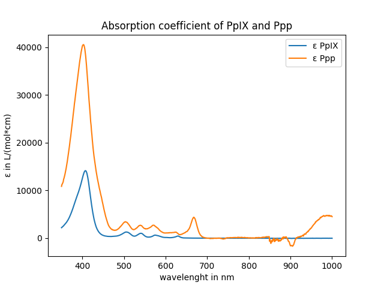

# Mathematical model of photodynamic therapy

## Installing the requirements
Please navigate into the project folder. Then, enter the following line into the terminal:

```bash
pip install -r requirements.txt
```

## Running the simulation
To start the simulation, the main file has to be executed. This can be done either by simply pressing on the file (open with Python), 
or by typing 
```python
python main.py 
```
into the terminal (while being inside the project folder).

Press on this link:
http://127.0.0.1:8050/
in order to open the simulation in your browser.

## Absorbtion data
The absobtion coefficient has been derived from our experiments by measuring the absobtion intensity of PpIX and Ppp after 0J and 100J of irradiation.

Assuming that, for an Energy Dose of 0J, only PpIX exists in the solution, the apsorption coefficient for PpIX can be calculated by as:
```python
# The lenght the light travels inside the solution while the absorbance intensity is measured.
L = 1

# Calculate the apsorption coefficient for PpIX
epsilonPpIX = intensity_100J_0J["0J"] * 1/(concentration_PpIX_0J) * 1/L
```

After 100J, we assume that the intensity is the sum of the absorbtion intensity of PpIX and Ppp.

We used the simulation to predict the concentration of PpIX and Ppp after 100J Energy Dose (with 10 mW/cm^2). With those concentrations, the absorption coefficient of Ppp can be calculated as the following:

```python
# Calculate the apsorption coefficient for Ppp using the total intensity at 100J and subtract the influence of PpIX 
epsilonPpp = (intensity_100J_0J["100J"]/L - epsilonPpIX * concentration_PpIX_100J) / (concentration_Ppp_100J)
```

This led to the following absorbtion coefficients for PpIX and Ppp:



In order to use other data or other values for the concentration of PpIX and Ppp (for 0J and 10J), please adjust the values inside the config.py file.

## config.py
The values of all parameters, data file locations and setup definitions are defined in the config file. If needed, it can be adjusted before starting the simulation.
